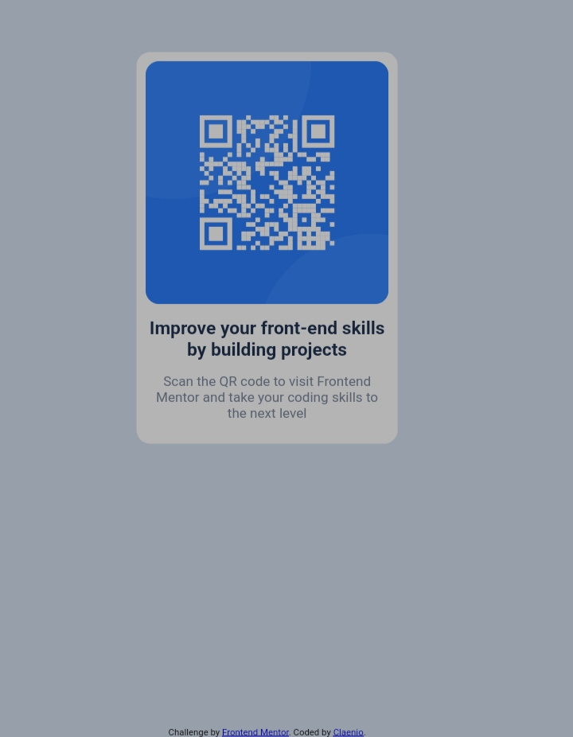

# Frontend Mentor - QR code component solution

This is a solution to the [QR code component challenge on Frontend Mentor](https://www.frontendmentor.io/challenges/qr-code-component-iux_sIO_H). Frontend Mentor challenges help you improve your coding skills by building realistic projects. 

## Table of contents

  - [Screenshot](#screenshot)
  - [Links](#links)
  - [Built with](#built-with)
  - [Useful resources](#useful-resources)
- [Author](#author)

### Screenshot

### Links

- Solution URL: [Add solution URL here](https://github.com/Claenio/QR-Code-Challenge)
- Live Site URL: [Add live site URL here](https://htmlpreview.github.io/?https://github.com/Claenio/QR-Code-Challenge/blob/master/index.html)

### Built with

- Semantic HTML5 markup
- CSS custom properties
- Flexbox
- Mobile-first workflow
- Media-Queries
- Responsive design

### Useful resource

- [Media queries](https://www.w3schools.com/css/css_rwd_mediaqueries.asp) - This helped me for understand about media queries and breakpoints.

## Author

- Github - [Claenio](https://github.com/Claenio)

